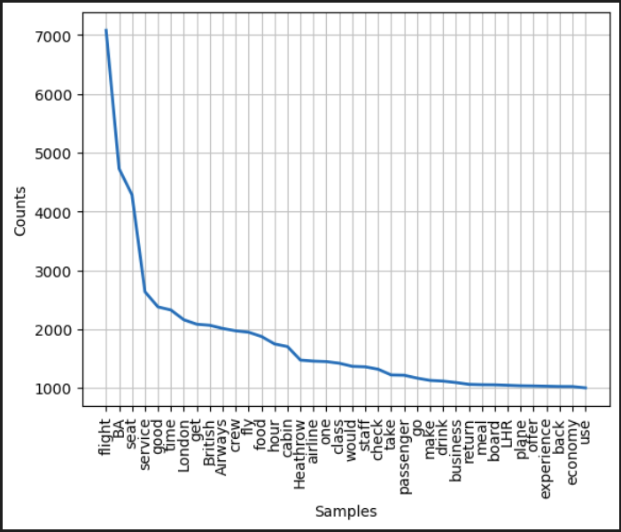

### **Project Name: British Airways Reviews Sentiment Analysis**

### **Overview**
This project aims to analyze customer reviews of British Airways from the website "Airline Quality". It utilizes web scraping techniques to extract text data, performs data preprocessing including text cleaning, tokenization, part-of-speech tagging, stopwords removal, and lemmatization. Finally, sentiment analysis is conducted using the VADER (Valence Aware Dictionary and sEntiment Reasoner) sentiment analysis tool, and the results are visualized through pie charts and word clouds.

### **Setup**
Ensure you have Python installed along with the necessary libraries like `requests`, `BeautifulSoup`, `pandas`, `nltk`, `matplotlib`, `wordcloud`, and `vaderSentiment`.

### **Usage**
1. Run the script to scrape the desired number of pages of reviews from the British Airways section on "Airline Quality".
2. Preprocess the data including cleaning, tokenization, POS tagging, and lemmatization.
3. Conduct sentiment analysis using the VADER sentiment analysis tool.
4. Visualize the sentiment analysis results using pie charts and word clouds.

### **How to Run**
1. Clone or download this repository.
2. Open a terminal and navigate to the project directory.
3. Run the script using `python script_name.py`.
4. Follow the prompts to input the desired number of pages to scrape.

### **Dependencies**
- Python 3.x
- Libraries: `requests`, `BeautifulSoup`, `pandas`, `nltk`, `matplotlib`, `wordcloud`, `vaderSentiment`

### **Notes**
- Ensure a stable internet connection for successful web scraping.
- Adjust the `pages` variable to scrape more or fewer pages of reviews as needed.
- Customize the visualization parameters to suit your preferences.

### **Contributors**
- Gabin H. VEGLO

### **License**
#**This project is licensed under the MIT License.**#
